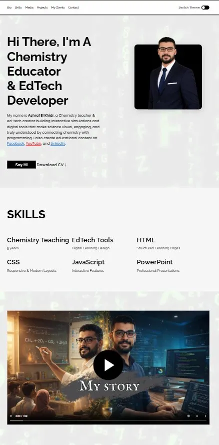
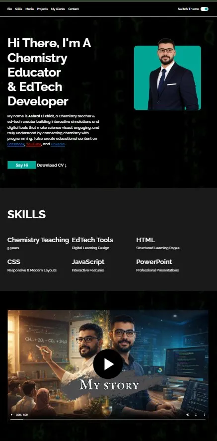

# 🧪 Ashraf Elkhidr — Chemistry Educator & EdTech Developer Portfolio

---

## 📌 Description

A clean, fully responsive personal portfolio website for **Ashraf El Khidr** — a Chemistry teacher and EdTech creator who builds interactive simulations and digital tools to make science visual and engaging. The site showcases his skills, featured projects, client testimonials, and contact information, with a smooth dark/light theme toggle and mobile-first navigation.

---

## 🖼️ Demo / Preview

> **Live Demo:** [🔗 ashrafelkhidr.github.io/personal-website](https://ashrafelkhidr.github.io/personal-website/)



---

## ✨ Features

- 🌗 **Dark / Light Theme Toggle** — Smooth CSS-variable-driven theme switching with a custom animated toggle
- 📱 **Fully Responsive** — Adapts seamlessly across desktop, tablet, and mobile (500px, 800px, 1000px breakpoints)
- 🍔 **Animated Burger Menu** — Mobile nav with CSS-only open/close animation (no JS required)
- 🎬 **Background Video Loop** — Subtle ambient video loop with low opacity for visual depth
- 🎥 **Media Section** — Embedded video with custom poster image for self-introduction
- 🧑‍🏫 **Skills Showcase** — Grid layout highlighting teaching, EdTech, and web development skills
- 📂 **Featured Projects** — Alternating image-text layout for featured interactive chemistry courses
- 💬 **Client Testimonials** — Horizontally scrollable, snap-scrolling opinion cards
- 📬 **Contact Form** — Validated form with name, Egyptian phone number pattern, and message fields
- 🔗 **Social Links** — Facebook, Twitter, LinkedIn, GitHub, Instagram, YouTube integration
- 🔄 **Smooth Scroll & Active Nav Highlighting** — CSS `:target`-based active link detection with no JavaScript
- ⬇️ **Downloadable CV** — Direct PDF download link from the bio section

---

## 🛠️ Tech Stack

| Technology | Purpose |
|---|---|
| **HTML5** | Semantic page structure and accessibility |
| **CSS3** | Layout (Grid & Flexbox), animations, CSS variables, responsive design |
| **Google Fonts** | Raleway (body) + Poppins (accents) typography |
| **CSS Custom Properties** | Full theme switching (light/dark mode) without JavaScript |

> No frameworks, no build tools, no dependencies — pure vanilla web stack.

---

## 🚀 Installation

Clone the repository and open locally — no build step required.

```bash
# 1. Clone the repository
git clone https://github.com/Ashrafelkhidr/portfolio.git

# 2. Navigate into the project directory
cd portfolio

# 3. Open in your browser
open index.html
# or simply double-click index.html in your file explorer
```

> 💡 For the best experience, serve the project through a local server to allow video and font loading:

```bash
# Using VS Code Live Server extension (recommended)
# Or using Python's built-in server:
python -m http.server 8000
# Then visit: http://localhost:8000
```

---

## 📖 Usage

### Navigation
- Click any link in the top navigation bar to scroll to that section
- The active section's nav link highlights automatically via CSS `:target`
- On mobile (< 500px), tap the **☰ burger icon** to open/close the nav menu

### Theme Toggle
- Use the **"Switch Theme"** toggle in the header to switch between light and dark mode
- The theme preference applies site-wide instantly via CSS variable overrides

### Contact Form
- Fill in your full name, an Egyptian mobile number (format: `01X-XXXXXXXX`), and a message
- Submit the form — it validates all fields before submission
- Direct email link available for quick outreach

### CV Download
- Click **"Download CV ↓"** in the bio section to download the PDF resume directly

---

## 📁 Project Structure

```
portfolio/
│
├── index.html               # Main HTML file (single-page layout)
├── results.html             # Form submission result page
│
├── css/
│   └── style.css            # All styles (minified, with source map)
│
├── images/
│   ├── personal-pic..png    # Profile photo
│   ├── projects_img.png     # Featured project screenshot
│   ├── My_Story.png         # Video poster image
│   └── brand/               # Social media SVG icons
│       ├── facebook.svg
│       ├── twitter.svg
│       ├── LinkedIn.svg
│       ├── github.svg
│       ├── instagram.svg
│       └── youtube.svg
│
├── video-loop.mp4           # Background ambient video
├── My_Video.m4v             # Bio/intro video (MP4)
├── My_Video.webm            # Bio/intro video (WebM fallback)
└── Ashraf(cv).pdf           # Downloadable CV
```

---

## 🔮 Future Improvements

Based on the current codebase, here are smart next steps:

- [ ] **🗂️ Projects Data Layer** — Move project entries to a JSON file and render them dynamically with JavaScript to make additions easier
- [ ] **💾 Theme Persistence** — Save the user's dark/light mode preference to `localStorage` so it persists across page visits
- [ ] **📜 Scroll-triggered Animations** — Use `IntersectionObserver` to animate sections into view as the user scrolls
- [ ] **✅ Form Backend** — Connect the contact form to a service like [Formspree](https://formspree.io) or [EmailJS](https://www.emailjs.com) for real email delivery (currently uses `results.html` only)
- [ ] **🌍 Live Deployment** — Deploy via [GitHub Pages](https://pages.github.com), [Netlify](https://netlify.com), or [Vercel](https://vercel.com) for a public URL
- [ ] **♿ Accessibility Audit** — Add `aria-label` attributes to icon-only links and improve keyboard navigation
- [ ] **🖼️ Image Optimization** — Convert images to `.webp` format and add `loading="lazy"` for faster load times
- [ ] **📊 Analytics** — Integrate a privacy-friendly analytics tool (e.g., [Plausible](https://plausible.io)) to track visitors
- [ ] **🌐 Multi-language Support** — Add an Arabic version given the Egyptian audience and phone number pattern already in the form

---

## 👨‍💻 Author

**Ashraf El Khidr**
*Chemistry Educator & EdTech Developer*

- 🐙 [GitHub](https://github.com/Ashrafelkhidr)
- 💼 [LinkedIn](https://www.linkedin.com/in/ashraf-elkhidr-45b744387/)
- ▶️ [YouTube](https://www.youtube.com/@elkhidrchemistry)
- 📘 [Facebook](https://www.facebook.com/ashraf.muhammed.731135)
- 📷 [Instagram](https://www.instagram.com/mr.ashrafelkhidr/)

---

> *"Connecting chemistry with programming to make science visual, engaging, and truly understood."*

---

© 2026 Ashraf Elkhidr — All Rights Reserved
